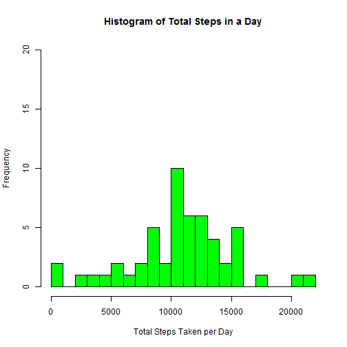
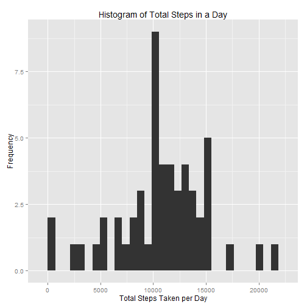
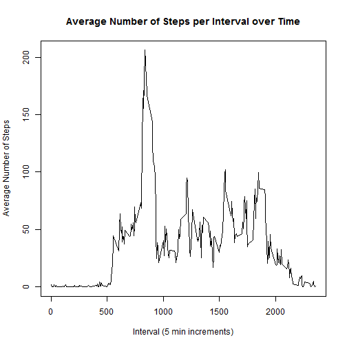
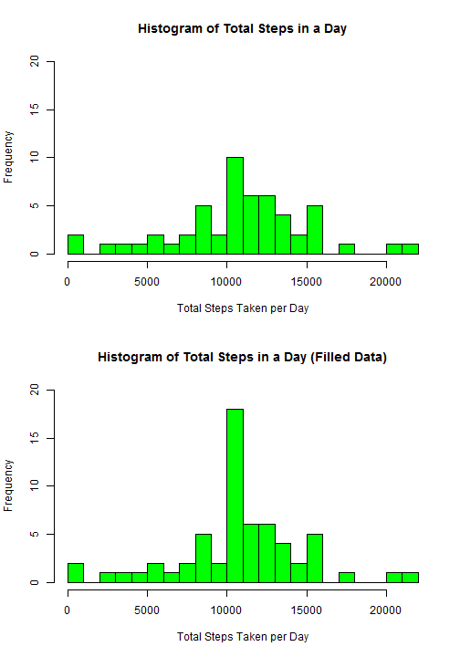
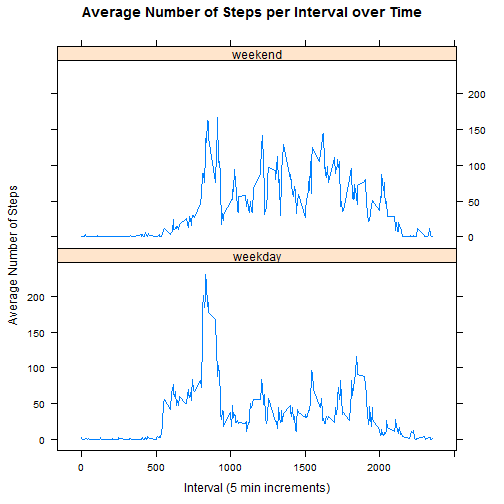

# Reproducible Research: Peer Assessment 1
It is now possible to collect a large amount of data about personal movement using activity monitoring devices such as a Fitbit, Nike Fuelband, or Jawbone Up. These type of devices are part of the "quantified self" movement - a group of enthusiasts who take measurements about themselves regularly to improve their health, to find patterns in their behavior, or because they are tech geeks. But these data remain under-utilized both because the raw data are hard to obtain and there is a lack of statistical methods and software for processing and interpreting the data.

This assignment makes use of data from a personal activity monitoring device. This device collects data at 5 minute intervals through out the day. The data consists of two months of data from an anonymous individual collected during the months of October and November, 2012 and include the number of steps taken in 5 minute intervals each day.  

The following code assumes you have downloaded and unzipped the file activity.csv into your working directory.

## Loading and preprocessing the data
For this assignment we will be using the dplyr, ggplot2, and lattice packages in addition to base R, so the first activity is to load the packages into memory.

```r
require(dplyr)
require(ggplot2)
require(lattice)
```
As a first glance at the data, we will load the raw data into a data.frame and then copy it to another data.frame with rows containing NA removed so we can perform some exploratory analysis

```r
data <- read.csv("activity.csv", head = TRUE, stringsAsFactors = FALSE)
clean.data <- na.omit(data)
```
Looking at the data shows it has three (3) rows, with number of steps, the date, and the 5 minute interval that the row represents.  For the first part of the assignment we need to look at the total steps per day.  We will use the dplyr package to first group the data by the date, and then use the summarise() function to sum up the number of steps based on the grouping.  We will then plot the summations on a histogram in order to see how steps per day are distributed.  We will plot the histogram using both the base R and ggplot2 (since peer assessment may be on comparison to ggplot2 settings.)

```r
days <- group_by(clean.data, date)
total_days <- summarise(days, total = sum(steps, na.rm = TRUE))
hist(total_days$total, col = "green", xlab = "Total Steps Taken per Day",
     main = "Histogram of Total Steps in a Day", ylim = c(0,20), breaks = 20)
```

 

```r
ggplot(total_days, aes(x = total)) + geom_histogram() + labs(x = "Total Steps Taken per Day", y = "Frequency", title = "Histogram of Total Steps in a Day")
```

 
  
The histograms show that the Total Number of Steps appear to be Normally (Gaussian) distributed.  With only sixty (60) data points, it is reasonable to make that observation. More data would smooth out the curve.

## What is mean total number of steps taken per day?
Using the mean and median functions, we can calculate the centrality characteristics of the Total Number of Steps.  We should also look at the Standard Deviation to get a sense of how the data is distributed around the mean.

```r
paste("Mean =",mean(total_days$total), ";", "Median =", median(total_days$total), ";", "Standard Deviation =", sd(total_days$total), sep=" ")
```

```
## [1] "Mean = 10766.1886792453 ; Median = 10765 ; Standard Deviation = 4269.18049268242"
```
The mean and median are practically the same, reinforcing the notion that the Total Number of Steps is Normally Distributed.

## What is the average daily activity pattern?
Next we need to look at the daily pattern.  Again using dplyr, we group the data by interval and get an average number of steps over the entire two months.  We then take the averages and plot them to get a profile of average steps over a 'day'. 

```r
interval <- group_by(clean.data, interval)
interval_avg <- summarise(interval, avg = mean(steps))
plot(interval_avg$interval,interval_avg$avg, type = "l", xlab = "Interval (5 min increments)",
     ylab = "Average Number of Steps", main = "Average Number of Steps per Interval over Time")
```

 

The plot shows little to no activity from 2100 - 0500, with a peak near 200 around 0830, and sustained activity for the rest of the time. Using the grep() and max() functions, we can find the maximum point and the points on either side of it.

```r
max_point <- grep((max(interval_avg$avg)), interval_avg$avg)
interval_avg[(max_point-1):(max_point+1),]
```

```
## Source: local data frame [3 x 2]
## 
##     interval   avg
## 103      830 177.3
## 104      835 206.2
## 105      840 195.9
```

## Imputing missing values
Returning to the 'raw' data set we note that there are several NAs.  We use the summary() function to look at the entire data.frame and note that all NAs occur only in the steps column.  The function sum(is.na()) can also be used to just get NAs in the data.frame, but gives no additional information.

```r
summary(data)
```

```
##      steps           date              interval   
##  Min.   :  0.0   Length:17568       Min.   :   0  
##  1st Qu.:  0.0   Class :character   1st Qu.: 589  
##  Median :  0.0   Mode  :character   Median :1178  
##  Mean   : 37.4                      Mean   :1178  
##  3rd Qu.: 12.0                      3rd Qu.:1766  
##  Max.   :806.0                      Max.   :2355  
##  NA's   :2304
```

```r
sum(is.na(data))
```

```
## [1] 2304
```
  
To fill in the missing data, we will take the data.table that has the average steps taken per interval and use it to fill in the missing data, hence days that have all missing steps will be imputed with an 'average' days worth of steps.  The following code creates a logical vector, missing_data, based on if the data is missing and there is an NA.  We will create a new data.frame, filled.data, that will have the missing data filled in while preserving the state of the original data.frame in data.  The for loop goes thorugh each row of the data.frame and if the logical element is TRUE, reads the interval, and then pulls the average value from the interval_avg data.table and replaces the NA in the filled data.frame with the value. 

```r
missing_data <- is.na(data$steps)
filled.data <- data
for (i in 1:nrow(filled.data)) {
  if(missing_data[i] == TRUE) {
    missing_interval = filled.data[i,3]
    avg_index <- grep(missing_interval, interval_avg[,1])
    filled.data$steps[i] = interval_avg[avg_index,2]
  }
}
```

Repeating the same processing the on the filled data.frame as we did with the cleaned one, we group the steps together for each day and plot the histogram.  The original histogram is repeated for comparison.  We then calculate the Mean, Median, and Standard Deviation for the filled data.frame.


```r
filled.days <- group_by(filled.data, date)
filled.total_days <- summarise(filled.days, total = sum(steps))
par(mfrow = c(2,1))
hist(total_days$total, col = "green", xlab = "Total Steps Taken per Day",
     main = "Histogram of Total Steps in a Day", ylim = c(0,20), breaks = 20)

hist(filled.total_days$total, col = "green", xlab = "Total Steps Taken per Day",
     main = "Histogram of Total Steps in a Day (Filled Data)", ylim = c(0,20), breaks = 20)
```

 

```r
paste("Mean =", mean(filled.total_days$total), ";", "Median =",median(filled.total_days$total),";", "Standard Deviation =", sd(filled.total_days$total), sep =" ")
```

```
## [1] "Mean = 10766.1886792453 ; Median = 10766.1886792453 ; Standard Deviation = 3974.39074599954"
```

The histograms show that our imputing only changed the bin that contained the Mean days, which makes sense if we made NA days into average days.  This did nothing to the Mean, and brought the Median slightly closer to the Mean.  It did reduce the Standard Deviation by almost 200 steps.

## Are there differences in activity patterns between weekdays and weekends?
The final factor to look at is how Weekdays compare to Weekends.  In order to look at this feature we use the weekdays() and as.Date() functions to convert a date into the appropriate category.  When then use the gsub() function to convert Saturday and Sunday into Weekend and the rest into Weekday.  We then subset the data.frame into two separate data.frames based on Weekday or Weekend.  The functions group_by() and summarise() from dplyr are used as before to get the total steps in each interval, but now we have them separated by Weekday or Weekend.  We then add the factor for day to the data.tables and then rbind them.  Finally we use the lattice package to plot a scatterplot on two (2) panels based on the day.


```r
filled.data$day <- weekdays(as.Date(filled.data[,2]))
filled.data$day <- gsub("Sunday", "weekend", filled.data$day)
filled.data$day <- gsub("Saturday", "weekend", filled.data$day)
filled.data$day <- gsub("Monday", "weekday", filled.data$day)
filled.data$day <- gsub("Tuesday", "weekday", filled.data$day)
filled.data$day <- gsub("Wednesday", "weekday", filled.data$day)
filled.data$day <- gsub("Thursday", "weekday", filled.data$day)
filled.data$day <- gsub("Friday", "weekday", filled.data$day)

filled.data.weekday <- subset(filled.data, day == "weekday")
filled.data.weekend <- subset(filled.data, day == "weekend")

interval.weekday <- group_by(filled.data.weekday, interval)
interval.weekend <- group_by(filled.data.weekend, interval)
interval.weekday_avg <- summarise(interval.weekday, avg = mean(steps))
interval.weekday_avg$day <- "weekday"
interval.weekend_avg <- summarise(interval.weekend, avg = mean(steps))
interval.weekend_avg$day <- "weekend"

interval.week_avg <- rbind(interval.weekday_avg, interval.weekend_avg)
xyplot(interval.week_avg$avg ~ interval.week_avg$interval | interval.week_avg$day,
       layout = c(1,2), type = "l", xlab = "Interval (5 min increments)",
       ylab = "Average Number of Steps",
       main = "Average Number of Steps per Interval over Time")
```

 
  
Both plots show a peak of steps at the same time, but for Weekdays there is a sudden increase in steps from zero with level activity until the peak.  The Weekend data shows a more gradual buildup to a smaller magnitude peak.  Both factors have sustained steps after the peak, but the weekend has a higher average of steps than the weekday.  Both plots show steps decreasing gradually at the same time and at the same rate.
